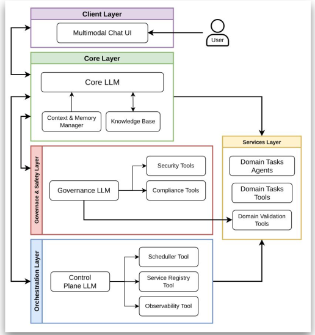

# SCRIBE System

## 🎯 Research Objective

A multi-agent system for processing academic references using specialized AI agents coordinated by a core orchestrator. This architecture follows the LLM-native style and demonstrates agent collaboration, task delegation, and hierarchical planning in an academic context.

## 📚 Documentation (main pipeline)

This documentation focuses **only on the main pipeline** (Docker Compose + supervisord + A2A + Control Plane + Core Agent + Frontend).

- **Main pipeline (end-to-end)**: [Main Pipeline](docs/MAIN_PIPELINE.md)
- **A2A agents (supervisord + compose) and capabilities**: [Agents](docs/AGENTS_A2A.md)
- **Core Agent (orchestrator)**: [Core Agent](docs/CORE_AGENT.md)
- **Control Plane (discovery + routing)**: [Control Plane](docs/CONTROL_PLANE.md)
- **Frontend (chat) + API integration**: [FrontEnd](docs/FRONTEND.md)
- **Execution examples (high-level logs)**: [Execution Examples](docs/EXECUTION_EXAMPLES.md)

## 🚀 Quickstart (Docker Compose)

Prerequisites:

- Docker + Docker Compose
- An `.env` file with at least `API_KEY` set (see below)

Start everything:

```bash
docker compose -f docker-compose.yaml up --build
```

Open:

- Frontend: `http://localhost:8080`
- API: `http://localhost:8000`

## 🔌 Main API endpoints (product)

The main API is implemented in `main.py` and exposes:

- `POST /execute`
  - JSON: `{ "message": "..." }`
- `POST /execute-with-pdf`
  - multipart form:
    - `user_input` (text)
    - `pdf` (PDF file)

## 🧩 Runtime architecture (what actually runs)

Docker Compose (`docker-compose.yaml`) starts:

- **`api`** (`scribe-api`):
  - FastAPI app at `:8000` (`main.py`)
  - **A2A agents** started by `supervisord.conf` on ports `9994–9998`
- **`control_plane`** (`scribe-control-plane`): discovery + routing at `:7000` (internal network)
- **`qdrant`** (`scribe-qdrant`): vector store at `:6333`
- **`ollama`** (`scribe-ollama`): model runtime at `:11434` (pulls `nomic-embed-text` on startup)
- **`front`** (`scribe-front`): Vite dev server (default `:8080`)

## 🔐 Environment variables

The API loads `.env` and maps `API_KEY` into `OPENAI_API_KEY` in `main.py`.

Minimum `.env` example:

```bash
API_KEY=your_key_here
```

## 🏗️ Multi-Agent Architecture



### Specialized Agents

#### Native agents

##### **Core Orchestrator Agent** 🎯
- **Role**: Main coordinator
- **Responsibilities**:
  - Receives user requests
  - Creates execution plans
  - Delegates tasks to specialized agents
  - Consolidates results
  - Manages workflow
- **Tools**: Delegation functions for each specialized agent

##### **Governance Agent** 🛡️
- **Role**: Policy enforcer
- **Responsibilities**:
  - Validate execution plans
  - Detect PII in data
  - Ensure policy compliance
  - Check plan efficiency
- **Tools**:
  - `get_system_policies`
  - `validate_plan_structure`
  - `detect_pii`
  - `check_plan_efficiency`

#### Domain agents

##### 1. **Reference Finder Agent** 🔍
- **Role**: Paper search specialist
- **Responsibilities**:
  - Extract identifiers (DOI, arXiv) from references
  - Search Semantic Scholar API
  - Extract paper metadata
- **Tools**:
  - `search_paper_by_title`
  - `extract_identifiers_from_reference`
  - `guess_title_tool`

##### 2. **BibTeX Generator Agent** 📝
- **Role**: Bibliography entry creator
- **Responsibilities**:
  - Fetch BibTeX from DOI/arXiv
  - Construct BibTeX manually when needed
  - Validate BibTeX format
- **Tools**:
  - `fetch_bibtex_from_doi`
  - `fetch_bibtex_from_arxiv`
  - `create_bibtex_manually`
  - `validate_bibtex`

##### 3. **Reference Validator Agent** ✅
- **Role**: Quality control specialist
- **Responsibilities**:
  - Check metadata completeness
  - Validate BibTeX entries
  - Cross-check consistency
  - Provide quality reports
- **Tools**:
  - `check_metadata_completeness`
  - `check_bibtex_validity`
  - `cross_check_metadata_bibtex`

##### 4. **Paper Downloader Agent** 📥
- **Role**: PDF retrieval specialist
- **Responsibilities**:
  - Resolve DOI / arXiv IDs and locate legitimate PDF sources
  - Prefer open-access locations (when available)
  - Download PDFs to the local `pdfs/` directory so they can be indexed into memory
- **Tools**:
  - `query_crossref_by_doi`
  - `query_unpaywall`
  - `query_arxiv`
  - `download_pdf`

##### 5. **Hierarchical RAG Agent** 🧠
- **Role**: Grounded question answering over indexed paper content
- **Responsibilities**:
  - Retrieve relevant chunks from Qdrant-backed memories
  - Answer strictly from retrieved content (no hallucinations)
  - Cache system-memory results into private memory for faster follow-ups
- **Tools**:
  - `smart_retrieve_with_delimiter`

## 🔄 Workflow

### Step-by-Step Process

```
1. User submits a request
         ↓
2. Core Agent receives request
         ↓
3. Core creates execution plan
         ↓
4. Governance validates plan
         ↓
5. Core executes plan:
         ↓
6. Core consolidates results
         ↓
7. User receives final output
```

### Example Execution Flow

For input: " Give more information about Smith, J. (2020). AI Research. Conference."

```
Core Agent:
  ├─ Creates Plan: [find_reference, generate_bibtex, validate]
  ├─ Delegates to Governance: validate plan
  │   └─ Governance: ✓ Plan approved
  ├─ Delegates to Reference Finder: search "Smith AI Research 2020"
  │   └─ Reference Finder: ✓ Found paper metadata
  ├─ Delegates to BibTeX Generator: create BibTeX
  │   └─ BibTeX Generator: ✓ Generated BibTeX entry
  ├─ Delegates to Validator: validate data
  │   └─ Validator: ✓ Quality check passed
  └─ Returns: Complete reference with BibTeX
```

## 🚀 Installation

Recommended: use Docker Compose (see **Quickstart** above).

For local Python development (without Compose), you are responsible for running dependencies (Qdrant, Ollama) yourself.

## 📖 Usage

### Via Frontend

- Open `http://localhost:8080`
- Start a chat and optionally attach a PDF

### Via API (curl)

```bash
curl -sS -X POST "http://localhost:8000/execute" \
  -H "Content-Type: application/json" \
  -d '{"message":"Find metadata and BibTeX for: Attention is All You Need"}'
```

### Example Output

```json
{
  "total_references": 2,
  "successful": 2,
  "failed": 0,
  "results": [
    {
      "reference": "Vaswani, A., Shazeer, N...",
      "status": "success",
      "metadata": {
        "title": "Attention is All You Need",
        "authors": ["Ashish Vaswani", "Noam Shazeer", ...],
        "year": 2017,
        "url": "https://..."
      },
      "bibtex": "@inproceedings{vaswani2017attention,...}"
    },
    ...
  ]
}
```

## ⚙️ Configuration (`src/entities/config.py`)

### LLM Settings

`USE_OLLAMA` - enables or disables the use of the Ollama backend for model execution.

`MODEL` - specifies the language model to be used by the system.

`TIMEOUT` - defines the maximum time (in seconds) allowed for a single model request before it is aborted.

`TEMPERATURE` - controls the randomness of the model’s responses. Lower values make outputs more deterministic, while higher values increase creativity.

`MAX_RETRIES` - sets how many times the system will retry a failed model request.

`VERBOSE` - enables detailed logging, useful for debugging and understanding internal execution flow.

### Core Configuration

`CORE_CONFIG` - groups settings related to the internal agent system.

`AVALIABLE_AGENTS` - defines which agents are enabled and can participate in the execution pipeline. The order may matter depending on the orchestration logic.

`PLAN_OUTPUT` - defines the format or style of the generated plans produced by the planning agent.

### Governance Configuration

`POLICIES` - the system policies that governance agent will use to validate information.

### Model Recommendations

| Model | RAM | Speed | Accuracy |
|-------|-----|-------|----------|
| gpt-4.1-mini | Cloud | Fast | Good |
| gpt-5 | Cloud | Slower | Best |
| qwen3:14b+ | 10GB+ | Medium | Good |


## 📝 Extending the System

### Adding a New Agent

This project uses **A2A + Control Plane** so agents can be **fully decoupled**:

- an agent can run in **any language** and with **any framework**
- as long as it exposes the **A2A HTTP interface** (Agent Card + JSON-RPC `message/send`)
- and listens on a port in the Control Plane scan range (**9000–9999**)

#### Requirements (A2A contract)

Your agent service must:

1. Serve an Agent Card at:
   - `GET /.well-known/agent-card.json`
2. Accept JSON-RPC calls via HTTP at the service base URL:
   - `method`: `message/send`
   - read the user text from `params.message.parts[0].text`
3. Run on a port between **9000 and 9999**

#### How discovery works (Control Plane)

The Control Plane scans the **9000–9999** range and registers any service that responds with an Agent Card. Once registered, the Core Agent can call it **by name** via the Control Plane, without knowing its URL/port.

#### Example steps (Docker Compose / supervisord)

1. Implement your A2A server (any language/stack).
2. Pick a port in `9000–9999` that is not in use (e.g. `9010`).
3. Run it somewhere reachable by the Control Plane:
   - inside the Compose network (recommended), or
   - externally, as long as the Control Plane can reach it by host + port.
4. Ensure `/.well-known/agent-card.json` returns your agent metadata + skills.
5. Restart the Control Plane (or call `POST /refresh`) so it re-scans and discovers the new agent.

#### Execution logs (high-level)

See `docs/EXECUTION_EXAMPLES.md` for high-level execution logs and traces of the main pipeline.


## 📚 Dependencies

- **crewai**: Multi-agent framework
- **litellm**: LLM interface
- **requests**: HTTP client
- **doi2bib3**: DOI to BibTeX converter
- **beautifulsoup4**: HTML parsing
- **bibtexparser**: BibTeX parser

See `requirements.txt` for the full dependency list.

## 📜 License

MIT License - Free for research and educational use

## 🤝 Contributing

This is a research project. Contributions welcome:
- New specialized agents
- Improved tools
- Better governance policies
- Performance optimizations

## 📞 Support

For issues or questions about the multi-agent architecture:
1. Check verbose output (`VERBOSE=True`)
2. Test individual agents
3. Review agent logs
4. Check Ollama connection

---

**Note**: This system is designed for academic research on multi-agent coordination. The architecture prioritizes agent specialization and clear delegation patterns over raw performance.
